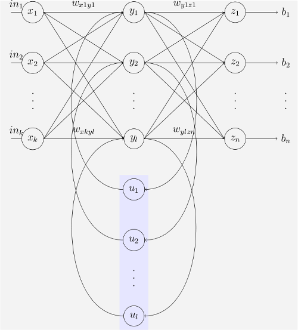

# Introducción

* Sinapsis y botón sináptico, ¿son sinónimos?

    Respuesta: más o menos. El botón sináptico es el lugar en el que ocurre la sinapsis.

* Tolerancia a fallos y robustez: ejemplo de red parcialmente dañadas pero que más o menos funciona igual, y ejemplo de cómo se le pasa una entrada incompleta (información faltante) a una red
* Diferencia entre capacidad de aprendizaje y adaptabilidad
* Diapositiva 5: "¿cómo lo modelamos?" ¿A qué se refiere cada item? ¿Los modelos con énfasis en lo simbólico es para modelos del contenido, y lo otro respectivamente?

    Respuesta: Casi seguro que es así.

* Clasificación de redes recurrentes. ¿Por qué incluye a los SOM?

# Perceptrón multicapa

* Diapositiva 16: ¿Por qué mucha bilbiografía le llama "capa de entrada" solo a las entradas, y después a todas las capas que no son de salida las llama "ocultas"? ¿Por qué se usa el término "capa oculta"? ¿Porque de afuera no se ve lo que hace o porque el significado de lo que hace está oculto?
* ¿Cuáles son parámetros y cuáles son hiperparámetros?
* ¿Cómo se entrena un MLP por lotes?

    Respuesta: Similar al entrenamiento online. Para cada patrón, se calculan las correcciones a hacer en los pesos, pero en lugar de aplicarlos inmediatamente, se acumulan estos $\Delta$s en una matriz auxiliar. Luego de procesar todos los patrones, se aplican los $\Delta$s acumulados.

* ¿Cuándo es útil entrenar un MLP por lotes? ¿Cómo se compara con el entrenamiento online?

# Capacidad de generalización

* Validación cruzada: ¿Es sólo particionar? ¿O es el particionar varias veces?
* Error de predicción en series. ¿Para qué casos se prefiere cada medida de error?

# Redes con RBFs

* ¿Cómo se entrenaría con el método del gradiente una red con RBFs?
* Entrenamiento - Método 2: ¿En qué consiste? ¿En hacer primero el método 1 y luego adaptar las RBFs con el método del gradiente descendente?
* Método 1 - Segunda parte del entrenamiento - Parte supervisada. Métodos de entrenamiento. ¿Por qué no se usa usualmente el entrenamiento por pseudo-inversa?

# LVQ

* Ejemplo de sistema de compresión y descompresión usando LVQ

# Redes dinámicas

* Retropropagación a través del tiempo: Las redes que se entrenan ¿terminan siendo total o parcialmente recurrentes?
* TDNN: Las salidas finales de la red, ¿son todas predicciones de instantes futuros? ¿O son una predicción futura mas predicciones pasadas?
* Redes de Elman: El siguiente gráfico ¿es correcto?

# Lógica

* Conjunto de conflicto. Cuando para una regla de la memoria de producciones se activa su premisa con distintos hechos de la memoria de trabajo, ¿se considera que son reglas diferentes para meterlas en el conjunto de conflicto?

    Respuesta: No, es una sola regla.

* Fase de cotejo: Entender bien qué lista se genera en la unificación

# Lógica borrosa

* ¿Ejemplo de paralelo entre la representación 2D y gráfica de funciones de membresía?
* ¿Está bien decir que un conjunto binario es también borroso?

# Sistemas borrosos

* Cuando se componen todas las reglas de una FAM en una matriz M para luego usarla por correlación mínimo, eso ¿también integra la etapa de composición?
* Relacionado con lo anterior: Las matrices que codifican reglas ¿sirven sólo para sacarnos de encima el evaluar las reglas como if-then?

# Búsqueda

* ¿Qué es el máximo factor de ramificación de un árbol de búsqueda?
* Búsqueda por profundidad: Este método falla en espacios infinitos. ¿Ejemplo de espacio de estados infinito?
* Métodos informados. Diferencia entre estrategia de búsqueda primero el mejor y búsqueda avara. Porque en clase lo dimos como si uno es un tipo del otro, pero en internet usan los términos como sinónimos.
* "¿Bajo qué condiciones se puede demostrar que la estrategia A* es óptima y completa?" Ver si tenemos un ejemplo en el que la heurística no sea "medir distancia en el mapa"

# Algoritmos genéticos

* Gen ¿es cada uno de los bits de un cromosoma? Alelos ¿son los valores posibles que puede tomar un gen?
* Función de aptitud: ¿Cuándo es deseable regular la suavidad de la función? Ejemplos. ¿Puede esto ser un mecanismo para resolver el problema del mar de mediocres?
* Parámetros de evolución. ¿De qué manera modifico el algoritmos para evolucionar estos parámetros?
* La selección de padres ¿es un operador?
* Estrategias de evolución - Mecanismos de selección: ¿Cuándo se usa uno u otro?
* Relación entre epistasis biológica y la epistasis en algoritmos genéticos
* Ejemplo de epistasis: codificación de un dígito decimal. ¿Qué hacer para evitar que se genere un genotipo inválido? Si esto no se puede hacer, ¿hay una manera de reparar este material genético?
* Selección de ruleta: Una solución al problema de los mares es potenciar los valores de fitness de los individuos por un $\alpha$. ¿Qué otra solución hay?

# Inteligencia colectiva

* Conectividad
    * Algunos de los algoritmos que vimos, ¿tiene conexiones unidireccionales?
    * Autómatas celulares con conexiones anisotrópicas. ¿Ejemplo?
* Las hormigas de una colonia
    * Autómatas de estados finitos: ¿cuáles serían la salida y los estados?
    * ¿son autómatas celulares? (en la naturaleza y en el algoritmos de colonia de hormigas)
* Los pájaros de una bandada:
    * Entradas: ¿La función de aptitud? ¿La posición actual?
    * Salidas: ¿La posición actual? ¿La mejor posición local? ¿La posición siguiente?
    * Estados: Posición y velocidad
* Enjambres de partículas: ¿por qué usaría uno el enjambre del mejor local?
* Los individuos de una población en un algoritmo genético ¿son agentes? ¿Son autómatas?

# Enjambre de partículas

* Nombre del $ \mathbb{r} $
